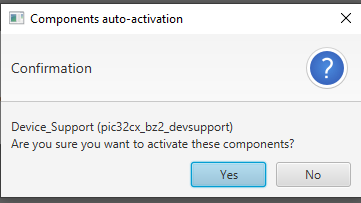
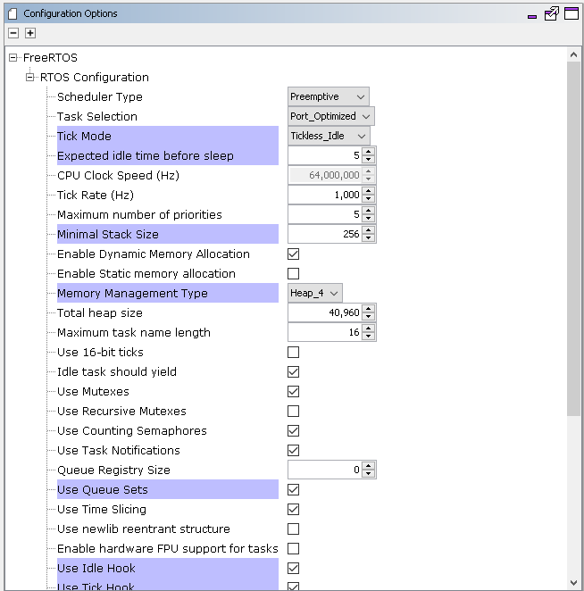
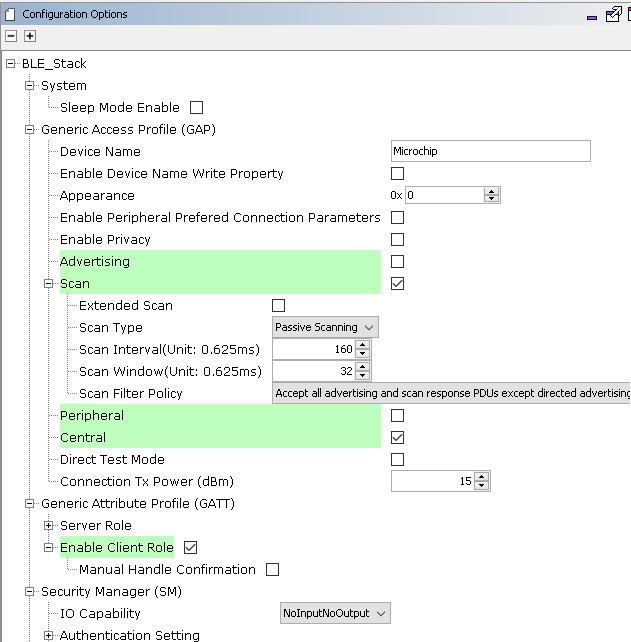

#  **Central - FreeRTOS BLE Stack and App Initialize** 

[Getting Started](../readme.md)

[Getting Started with Central Building Blocks](readme.md)

[**FreeRTOS and BLE Stack Setup**](freertos_ble_stack_init_central.md) **-->**[Adding UART](../chip_peripherals/uart/readme.md) **-->**[Legacy Scan](../central/legacy_scan/readme.md) 

## Introduction
This document will help users create a new MPLABx Harmony 3 project, configure FreeRTOS component and BLE stack component in the project, generate code using the Harmony 3 framework

## Recommended Reads

None

## Hardware Required

None

## Software Setup
-	[SDK Setup](../../../docs/pic32cx_bz2_wbz45x_sdk_setup.md)

## Steps to Init BLE Stack

This section explains the steps required by a user to develop this
application example from scratch using MPLABx Harmony 3 Framework

**Tip:** New Harmony 3 Users are recommended to go through the [overview](https://microchip-mplab-harmony.github.io/mhc/doc/readme.html) of Harmony 3. Users can add/remove different components like peripheral support and other wireless functionality by following steps mentioned [here](https://microchip-mplab-harmony.github.io/mhc/doc/readme_mhc_configuration.html). 

1. Create a new MPLAB Harmony 3 Project -- [link](../docs/creating_new_mplabx_harmony_project.md) for instructions

2. Open MPLAB Harmony 3 Configurator

	

	Default Harmony 3 Configurator window
	

3. **Double Click or Drag and Drop** the **BLE Stack** component on to the project graph (BLE Stack is part of Wireless Component)
	

4. Upon BLE Stack being added to project graph, the different component dependencies will be requested to be added. User has to select "yes" to add the dependant component 
	
	

5. Activate the components

	 

5. **Verify** Project Graph

	

6. Display FreeRTOS component configuration options by Selecting the component in Project Graph.
>	Tip: Upon selecting any Harmony 3 component the default configuration options available for user are displayed

7. **Configure FreeRTOS** component to the following. The configuration chosen here should suit most application needs, users are recommended to follow the FreeRTOS Customization documented [here](https://www.freertos.org/a00110.html) to meet their needs
	
	
	

8. Display BLE Stack component configuration options by Selecting the component in Project Graph.

	Default Configuration: Peripheral Device functionality is enabled by default. Central configuration needs to enabled and peripheral configuration should be unchecked

	

9. [Generate Code](../../../docs/generate_code.md)

9. Switch to MPLAB X IDE window and Build Project. The project should compile successfully.

	

10. Ensure correct compiler version as suggested in [SDK Setup](../../../docs/pic32cx_bz2_wbz45x_sdk_setup.md) is chosen

11. Build Project, upon building project user action is required as mentioned [here](../../../docs/user_action.md) 

## Where to go from here

-   [UART](../chip_peripherals/uart/readme.md)

