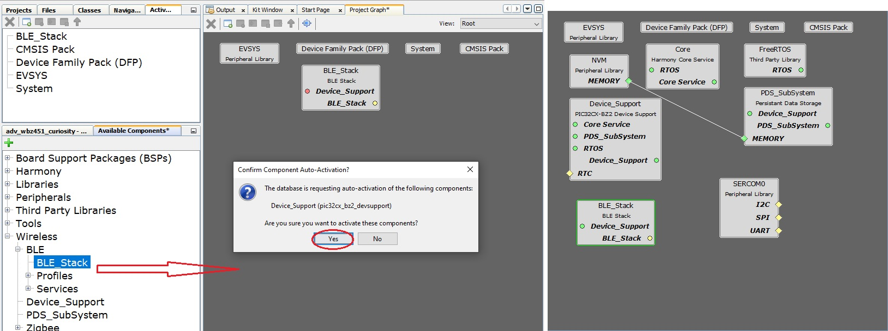
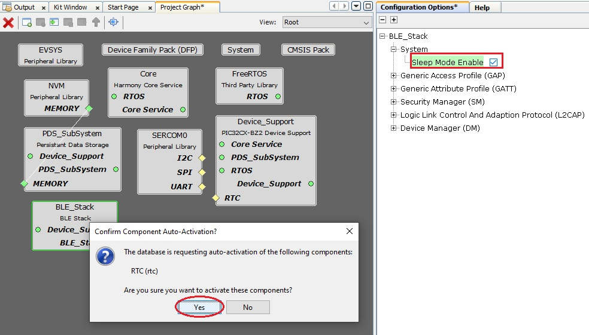
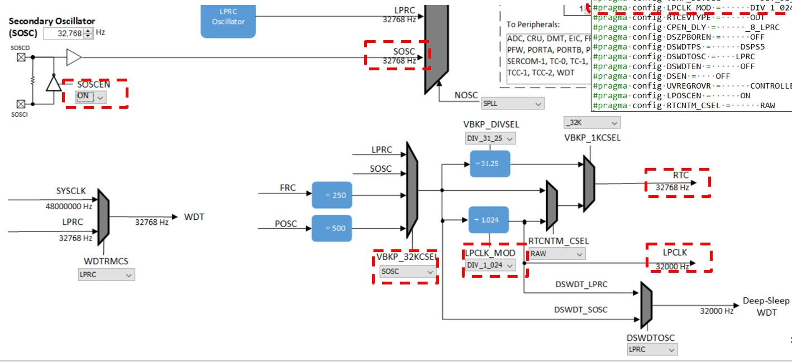
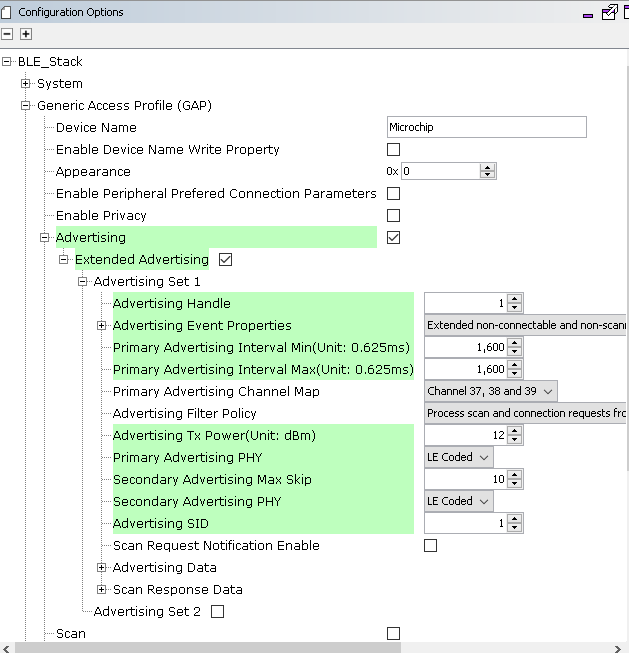
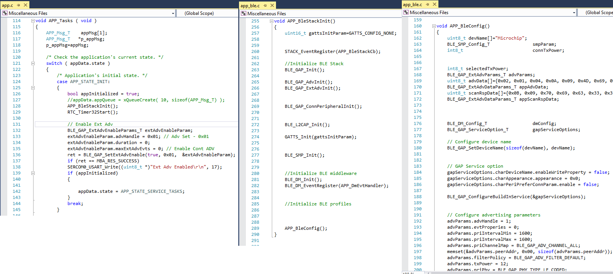

#  BLE Extended Advertisements with Lowpower mode Enabled

[Getting Started](../../readme.md)

[Getting Started with Peripheral Building Blocks](../../peripheral/readme.md)

[Adding UART](../../chip_peripherals/uart/readme.md) **-->** [Extended Advertisements](readme.md)

## Introduction

This document will help users enable Extended Advertisements (1M, 2M,
coded PHY -- 125kbps) on WBZ451 Curiosity Board. This example (ext_adv)
enables users to send application data using extended advertisements.
Extended Advertisements are used to send more data than the legacy
advertisements allow and allow long range functionality when using Coded
PHY. Use of Extended Advertisements also enables the users to select
between different PHYs (1M, 2M and **LE Coded**) which are not permitted
when using legacy advertisements. In BLE a peripheral or broadcaster
always starts with advertisements. Advertisement packets enable a
central or observer to discover a peripheral or broadcaster.

Extended Advertisements implemented in this example can be used for
sending more data (2M PHY) or do range tests (Coded PHY). For testing
these features a scanner Application can be used which is configured to
scan the extended advertisement packets.

To save power, low power mode can be enabled. If conditions are met then
WBZ451 will enter into sleep mode. Details will be discussed in later section.

Users can run the precompiled Application Example hex file provided with this
example on the WBZ451 Curiosity Board and go through the steps involved in 
developing this Application application from the scratch

## Recommended Reads

1.  [FreeRtos BLE App Initialize](../freertos_ble_stack_init_peripheral.md) 

2.  [Adding UART](../../chip_peripherals/uart/readme.md)

3.  [Low Power Details](../../../../docs/lowpower.md)

## Hardware Required

  |**Tool**                | **Qty**                        |
  |------------------------| -------------------------------|
  |WBZ451 Curiosity Board  | 1 (2 if testing with a scanner)|
  |Micro USB cable         | 1                              |
  
 Optional [Power Debugger](https://www.microchip.com/en-us/development-tool/ATPOWERDEBUGGER)/Multimeter/OscilloScope  to measure power. 
 
## SDK Setup

1.  [SDK Setup](../../../../docs/pic32cx_bz2_wbz45x_sdk_setup.md)

## Software

1.  [TeraTerm](https://ttssh2.osdn.jp/index.html.en) 

## Smartphone App
  None

## Programming the precompiled hex file or Application Example

### Programming the hex file using MPLABX IPE

1.  Precompiled Hex file is located <a href="hex/"> here </a>

2.  Follow the steps mentioned [here](https://microchipdeveloper.com/ipe:programming-device)

 **Caution:** Users should choose the correct Device and Tool information
### Programming the Application using MPLABX IDE

1.  Follow steps mentioned in section 4 of [SDK Setup](../../../../docs/pic32cx_bz2_wbz45x_sdk_setup.md) document

2.  Open and program the Application Example <a href="firmware"> ext_adv </a>  in MPLABX IDE 

## Demo Description

This Application Example enables users to transmit Extended
Advertisements @ Coded PHY data rate of 125 Kbps. PDU types of
ADV_EXT_IND and ADV_AUX_IND will be transmitted. Application data
("Microchip") is transmitted in Auxiliary packets (ADV_AUX_IND).
ADV_EXT_IND carries the Auxiliary Packet Information (ADV_AUX_IND) for
scanner to collect the data.

Demo will print "Ext Adv Enabled" information indicating the successful start of Coded PHY Advertisements on a terminal emulator like TeraTerm @ (Speed: 115200,
Data: 8-bit, Parity: none, stop bits: 1 bit, Flow control: none). Coded
PHY Advertisements are configured to be sent every 2 secs.

BLE Extended Advertisements (125 kbps, 500 kbps)cannot be scanned using a smartphone app. This could be due to support of only legacy advertisements on the smartphone or disabled extended adv API's in smartphone app.
 
## Testing
Users can use another WBZ451 Curiosity Board configured as [BLE Scan Ext Adv](../../central/scan_ext_adv/readme.md)

This section assumes that a user has already programmed the ext_adv and scan_ext_adv
application on 2 WBZ451 Curiosity Boards.

Board1 = WBZ451 Curiosity Board with Ext Adv Programmed
Board2 = WBZ451 Curiosity Board with Scan Ext Adv Programmed

Board1: Open TeraTerm @ (Speed: 115200, Data: 8-bit, Parity: none, stop bits: 1
bit, Flow control: none). Reset the board. Upon reset, "Ext Adv Enable" message is displayed on the TeraTerm.

Board2: Open TeraTerm @ (Speed: 115200, Data: 8-bit, Parity: none, stop bits: 1
bit, Flow control: none). Reset the board. Upon reset, "ExtAdv Scan
Enable Success" message is displayed on the TeraTerm. "Microchip"
message will be displayed as soon the WBZ451 module performs an extended
advertisement scan.

## Current Consumption Measurement

- Connect the Multimeter/Power Debugger/Oscillo Scope to Power Measurement Header J6.
If using Power Debugger, users can use [Data Visualizer](https://www.microchip.com/en-us/development-tools-tools-and-software/embedded-software-center/atmel-data-visualizer) to measure the current consumption

Current measured in sleep/standby mode is 575.6 uA and avg current consumption is around 723.0 uA 

Users of this package should go through the [known issues](../../../../../Documentation/Known%20Issues.pdf) document and understand the limitations if any with the current low power mode implementation

## Developing this Application from scratch using Harmony 3

This section explains necessary steps needed to develop this
application example from scratch using MPLABx Harmony 3 Framework

**Tip:** New Harmony 3 Users are recommended to go through the [overview](https://microchip-mplab-harmony.github.io/mhc/doc/readme.html) of Harmony 3. Users can add/remove different components like peripheral support and other wireless functionality by following steps mentioned [here](https://microchip-mplab-harmony.github.io/mhc/doc/readme_mhc_configuration.html).

1. Setup Harmony 3 framework. EA release package has all the neccessary componenet and should be downloaded individually from the link provided in the package. It is recommended to create framework in the root directory. The framework looks like 
   
   

2.  Create a new MPLAB Harmony 3 Project - [instructions](../../../../docs/creating_new_mplabx_harmony_project.md)

3.  Drag and drop BL_Stack in the project graph and select **Yes** to all pop ups. Drag and Drop SERCOM0 from Peripherals into project graph for UART messages. Project Graph will look lie 
 

4. Enable Low Power

   - Enable Low power mode by selecting **Low Power Enable** in BLE_Stack Configuration. Select **Yes** to all pop ups 

   
   
   - Click on MHC->Tools->Clock Configuration 
   
   
   
   - Enable SOSC clock 
   
   

## Configure Advertisement Configuration
- Select **BLE_Stack** component in project graph and make modifications as shown below

## Configure UART

Uart Configuration Details can be found [here](../../chip_peripherals/uart/readme.md)  

## Generate Code [link](../../../../docs/generate_code.md) for instructions

## Save the Configuration by clicking **MHC->Save Configuration** for future use.

## Files and Routines Automatically generated by the MHC
After generating the program source from MHC interface by clicking Generate Code, the BLE configuration can be found in the following project directories 

The [OSAL](http://ww1.microchip.com/downloads/en/DeviceDoc/MPLAB%20Harmony%20OSAL%20Libraries%20Help%20v2.06.pdf) , RF System, BLE System  initialization routine executed during program initialization can be found in the project files. This initialization routine is automatically generated by the MHC

The BLE stack initialization routine excuted during Application Initialization can be found in project files. This intitialization routine is automatically generated by the MHC. This call initializes and configures the GAP, GATT, SMP, L2CAP and BLE middleware layers.

Autogenerated, extended adverisement Data Format

  |**Source Files**        | **Usage**  |
  |------------------------|------------|
  |app.c                   |Application State machine, includes calls for Initialization of all BLE stack (GAP,GATT, SMP, L2CAP) related componenet configurations            |
  |app_ble.c               |Source Code for the BLE stack related componenet configurations, code related to function calls from app.c                                        |
  |app_ble_handler.c       |All GAP, GATT, SMP and L2CAP Event handlers 
  |app_user_edits.c        |User Code Change instruction|

> **Tip:** app.c is autogenerated and has a state machine based
> Application code sample, users can use this template to develop the
> application    
                                                                                                |
### Header Files 

-   ble_gap.h- This header file contains BLE GAP functions and is
    automatically included in the app.c file

### Function Calls

Harmony 3 generates and adds the code to initialize the BLE Stack GAP,
GATT, L2CAP and SMP in *APP_BleStackInit()* function

-   APP_BleStackInit() is the API that will be called inside the
    Applications Initial State -- APP_STATE_INIT in app.c
	
-   RTC_Timer32Start() defined in plib_rtc_timer.c. It call to start RTC Timer clock to facilitate low power mode.	

## User Application Development

### Include

-   definitions.h in all the files where UART will be used to print debug information 
>Tip: definitions.h is not specific to just UART peripheral, instead it should be included in all application source files where peripheral functionality will be exercised 
-   user action is required as mentioned [here](../../../../docs/user_action.md) 

### Start Ext Advertisement 

-   BLE_GAP_SetExtAdvEnable(0x01, 0);

This API is called in the Applications initialstate - APP_STATE_INIT in app.c

Users can exercise various other BLE Advertisement functionalities by
using [BLE Stack API](../../docs/api/driver/ble/docs/html/modules.html)

## Where to go from here

[Getting Started with Peripheral Building Blocks](../../peripheral/readme.md)
