#  BLE Custom Service(Peripheral)

[Getting Started](../../../readme.md)

[Getting Started with Peripheral Building Blocks](../../../peripheral/readme.md)

[BLE Connection](../../connection/readme.md) **-->** [Profiles and Services](../../profiles_services/readme.md) **-->** [BLE Custom Service](readme.md)

## Introduction

This tutorial will help users create a peripheral device with custom profile and control the RGB LEDs on the WBZ451 Curiosity board and button on the WBZ451 Curiosity board shall be used to enable or disable the LED status. Peripheral device will be WBZ45x Device and Central device can be a Smartphone with Light Blue App.The instructions mentioned below are applicable for a BLE Peripheral device.

Users of this document can choose to just run the precompiled Application Example hex file on the WBZ451 Curiosity board and experience the demo or can go through the steps involved in developing this Application from scratch.

## Recommended Reads

1.  [BLE Connection(peripheral)](../../connection/readme.md)

## Hardware Required

  |**Tool**                | **Qty**  |
  |------------------------| ---------|
  |WBZ451 Curiosity Board  | 1        |
  |Micro USB cable         | 1        |

## SDK Setup

1.  [SDK Setup](../../../../../docs/pic32cx_bz2_wbz45x_sdk_setup.md)

## Software

1.  [TeraTerm](https://ttssh2.osdn.jp/index.html.en)

## Smartphone App

1.  Light Blue

## Programming the precompiled hex file or Application Example

### Programming the hex file using MPLABX IPE

1.  Precompiled Hex file is located <a href="hex/"> here </a>

2.  Follow the steps mentioned [here](https://microchipdeveloper.com/ipe:programming-device)

 **Caution:** Users should choose the correct Device and Tool information
### Programming the Application using MPLABX IDE

1.  Follow steps mentioned in section 4 of [SDK Setup](../../../../../docs/pic32cx_bz2_wbz45x_sdk_setup.md) document

2.  Open and program the Application Example <a href="firmware"> custom_service </a>  in MPLABX IDE

## Demo Description

Upon programming the demo application, WBZ45x will start Advertising (connectable), central device (Smartphone) scanning for these advertisements will connect to the device. In case of using Light Blue App search for “pic32cx-bz” and connect. After a connection has been made Button and RGB LED status can be read and RGB LED can be controlled from the central device (Smartphone - Light Blue App). Button status will be notified if subscribed from central device (Smartphone).

Demo will print various events on a terminal emulator like TeraTerm @ (Speed: 115200, Data: 8-bit, Parity: none, stop bits: 1 bit, Flow control: none).

-   Start of the advertisement 	- “[BLE] Device Initialized. Ready for connection.”
-   Connection completed		 - “[BLE] Connected to Peer Device : <device address>” & “[BLE] Connection Handle: <handle>”
-   Write Request received		- “[BLE] GATT Write ATTR Handle 0x<handle>”
-   Read Request received		- “[BLE] GATT Read ATTR Handle 0x<handle>”
-   Recevied RGB Data			- “[BLE] RGB LED data 0x<Red Data> 0x<Green Data> 0x<Blue Data>”
-   Button press event 			- “[BLE] Custom Service Button Event :  RGB LED ON” & “[BLE] Custom Service Button Event :  RGB LED OFF”
-   BLE Disconnected 			- “[BLE] Disconnected Handle: %d, Reason: 0x<reason_code>”.

## Testing
This section assumes that user has programmed the Application Example on the WBZ451 Curiosity Board
**Demo Experience when using a Smartphone (Light Blue App) as Central Device**
-   Reset the WBZ451 Curiosity board, Open Terminal emulator like Tera Term, select the right COM port@ (Speed: 115200, Data: 8-bit, Parity: none, stop bits: 1 bit, Flow control: none).

-   open Light Blue App on your smartphone, Search and select the advertisement with Device Name "pic32cx-bz"

    

-   Once connected on Blue App on your smartphone, basic info like Adervetisement Data and Device information will be avilable"

    

-   Once connected on Blue App on your smartphone, find the custom service with the UUID 4d434850-5255-42d0-aef8-881facf4ceea"
	Two characteristics will be avilable on the custom service.Button characteristics with Readable,Notify property and RGB LED characteristics with Readable,Writable property

    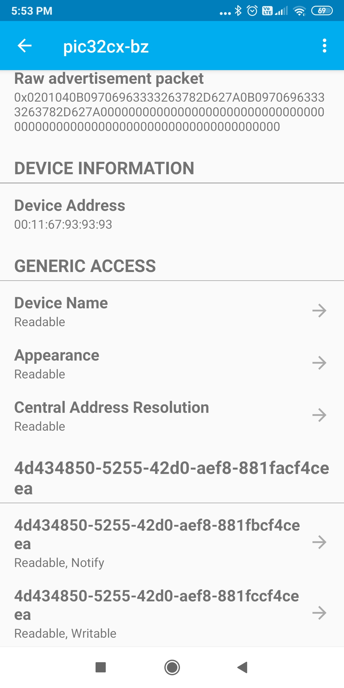

-   Click on the button characteristics which will have read option and subscribe. Read will give the current status of the button.

    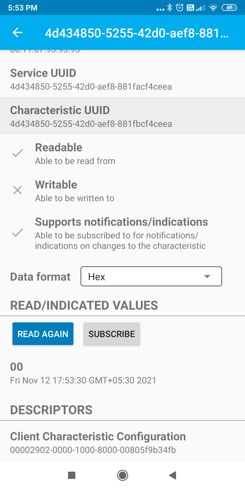

-   Click on the button characteristics subscribe option to listen for button change events.Button press activity will be notified to the central device without read intiated and toggle the RGB LEDs.

    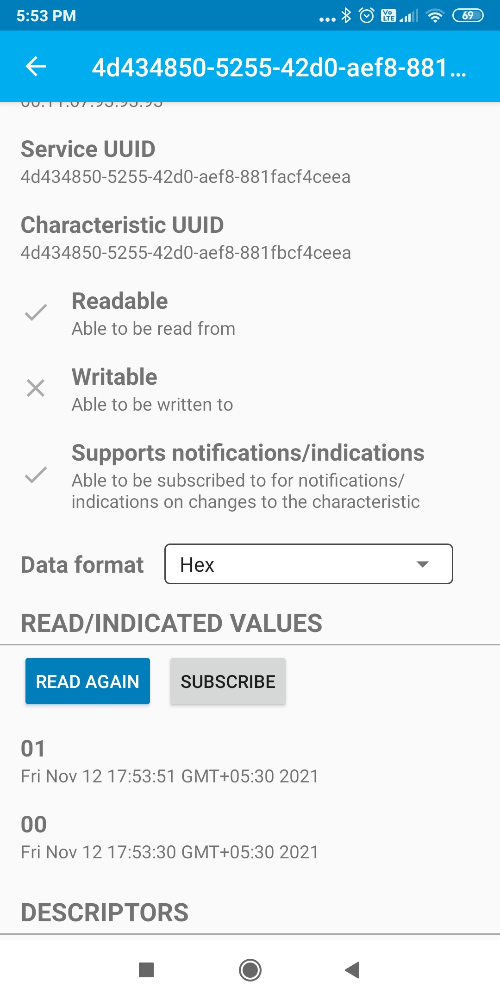 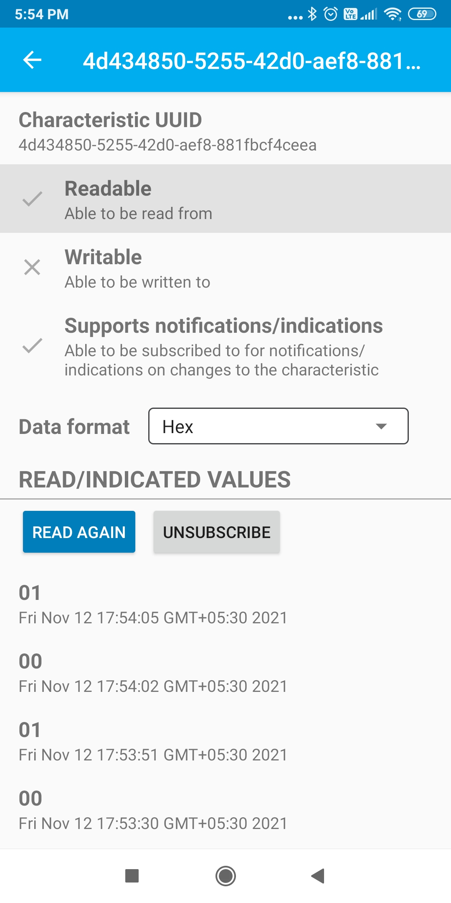

-   Click on the RGB LED characteristics which will have read and write option. Read will give the current values stored for the RGB LEDs.Value of zero will turn off the LED. Other than zero value will turn on LED.

    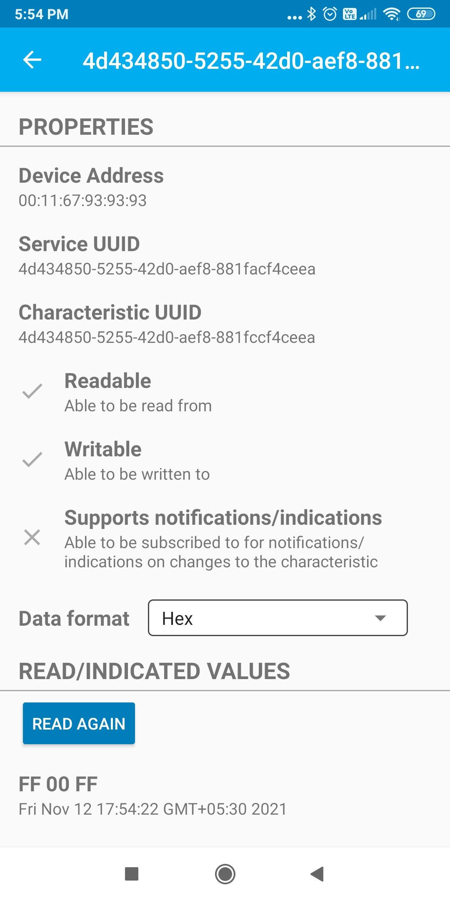

-   Click on the button characteristics write option provides option to write info which will change the RGB LED on/off condition.Read again to get the updated value for RGB LEDs.

    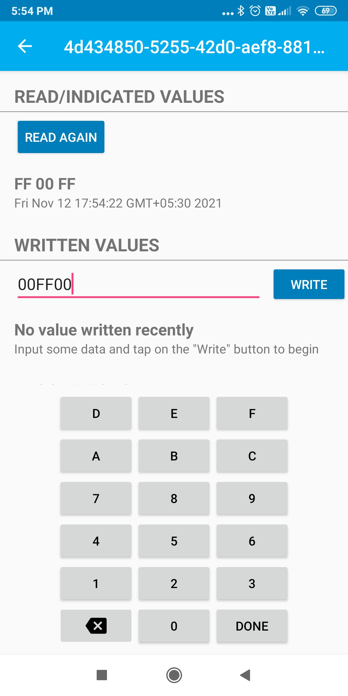 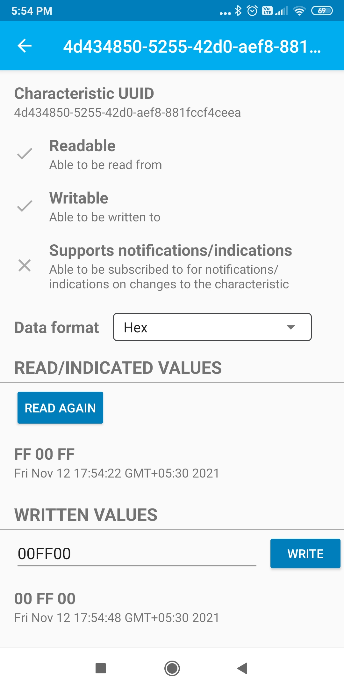

-   press back to disconnect the ble connection. Disconnected device will advertise again.

    

-   Every event will be notified in the terminal emulator.

## Developing this Application from scratch using Harmony 3

This section explains the steps required by a user to develop this
application example from scratch using MPLABx Harmony 3 Framework

**Tip:** New Harmony 3 Users are recommended to go through the [overview](https://microchip-mplab-harmony.github.io/mhc/doc/readme.html) of Harmony 3. Users can add/remove different components like peripheral support and other wireless functionality by following steps mentioned [here](https://microchip-mplab-harmony.github.io/mhc/doc/readme_mhc_configuration.html).

1.  Create a new MPLAB Harmony 3 Project -- [link](../../../../../docs/creating_new_mplabx_harmony_project.md) for
    instructions

2.  Import Harmony 3 component configuration -- This step helps users
    setup the basic Harmony 3 components required to start their
    Application Development
    Harmony 3 component configuration related to this Application is
    available [here](export.mhc)
    Users should follow the instructions mentioned
    [here](https://microchip-mplab-harmony.github.io/mhc/doc/readme_mhc_import_export.html) to import the Harmony 3 component configuration.

    **Tip:** Import and Export functionality of Harmony 3 component
    configuration will help users to start from a known working setup of Harmony 3
    configuration  

3.  Accept Dependencies or satisfiers, select "Yes"

4.  Verify if the Project Graph window has all the expected Harmony 3
    configuration

    

## Verify Custom Service Configuration
1. Select **BLE_Stack** component in project graph

    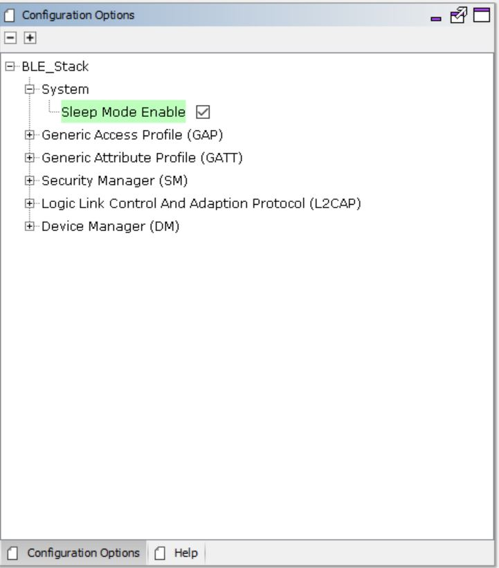

1. Select **FreeRTOS** component in project graph

    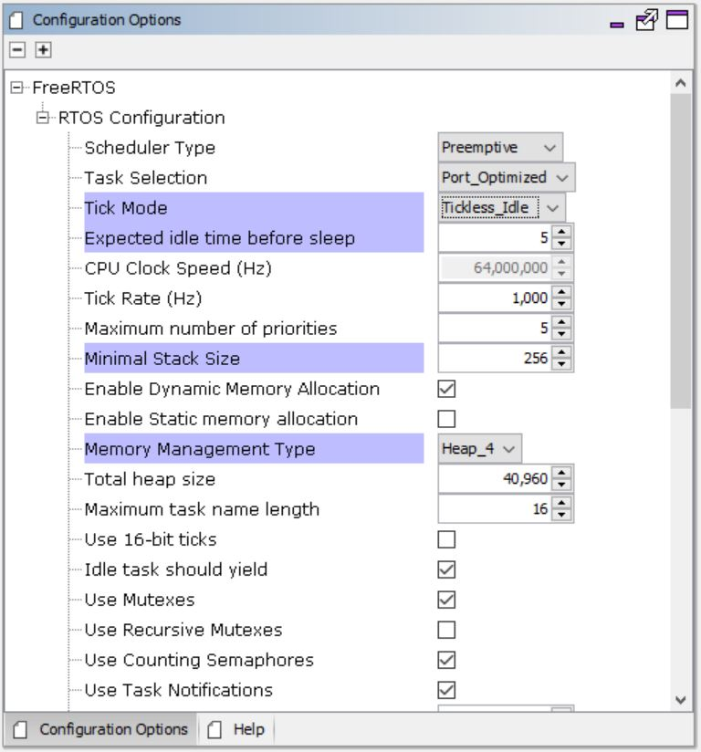

1. Select **SERCOM0** component in project graph

    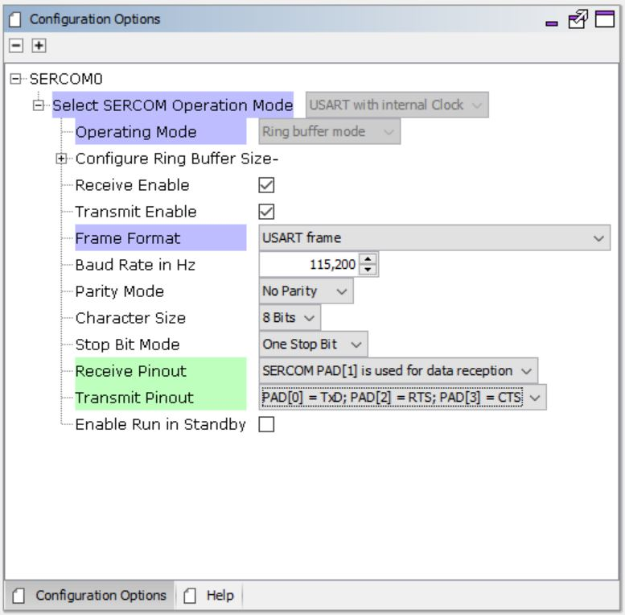

1. Select **System** component in project graph

    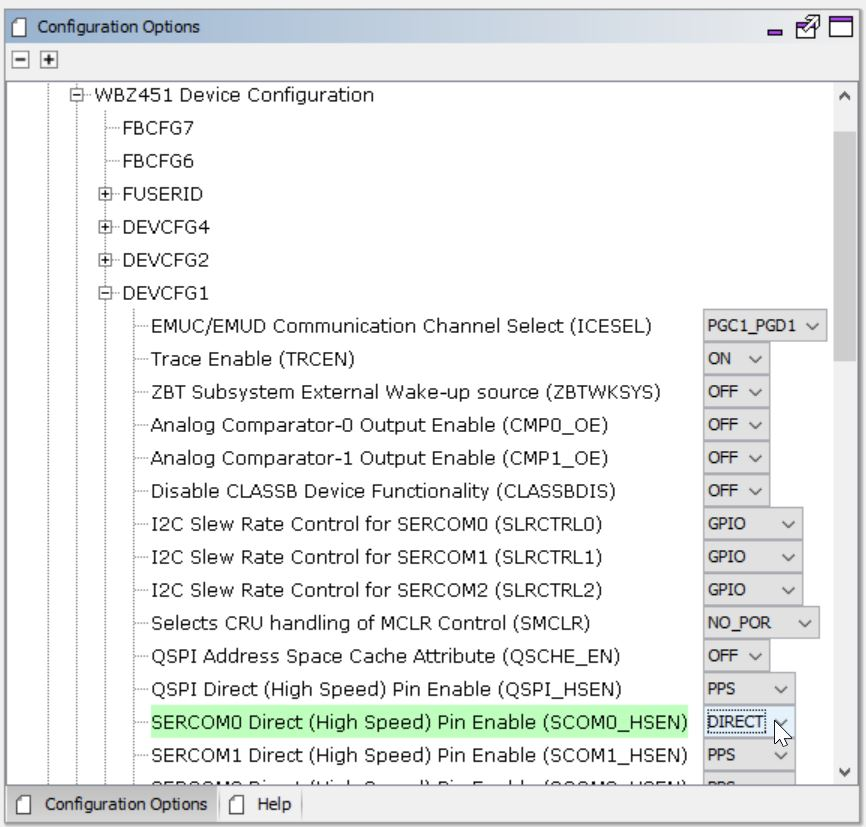

1. Select **EIC** component in project graph

    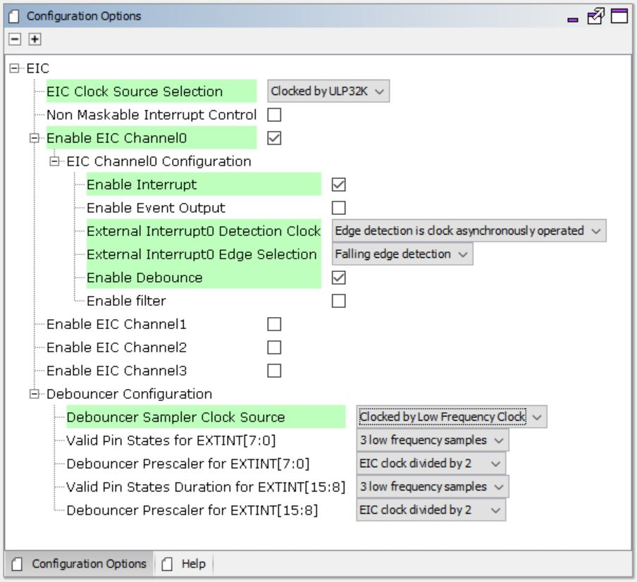

1. Select **Customized Service** component in project graph

    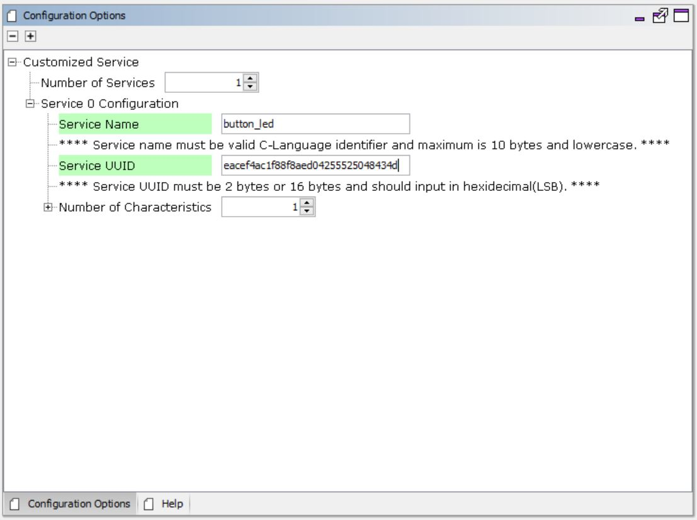
	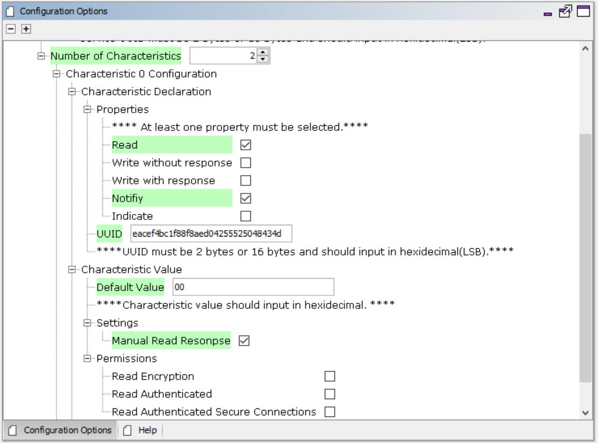
	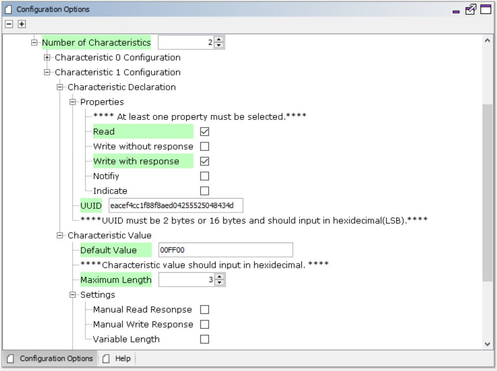

1. Verify the **Pin Configuration** and **Clock Configuration** from tools option as per low power guide.


## Generate Code [link](../../../../../docs/generate_code.md) for instructions

## Files and Routines Automatically generated by the MHC
After generating the program source from MHC interface by clicking Generate Code, the BLE custom service can be found in the following project directories

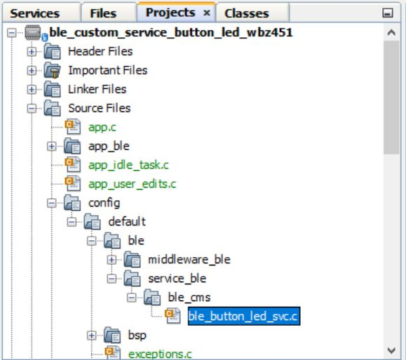


  |**Source Files**        | **Usage**  |
  |------------------------|------------|
  |app.c                   |Application State machine, includes calls for Initialization of all BLE stack (GAP,GATT, SMP, L2CAP) related componenet configurations            |
  |app_ble.c               |Source Code for the BLE stack related componenet configurations, code related to function calls from app.c                                        |
  |app_ble_handler.c       |All GAP, GATT, SMP and L2CAP Event handlers    |
  |ble_button_led_svc.c    |All Custom Service button RGB LEDs configurations and functions   |

- app_ble_custom_service header and source files can be copied from the reference application.

> **Tip:** app.c is autogenerated and has a state machine based

The [OSAL](http://ww1.microchip.com/downloads/en/DeviceDoc/MPLAB%20Harmony%20OSAL%20Libraries%20Help%20v2.06.pdf), RF System, BLE System  initialization routine executed during program initialization can be found in the project files. This initialization routine is automatically generated by the MHC

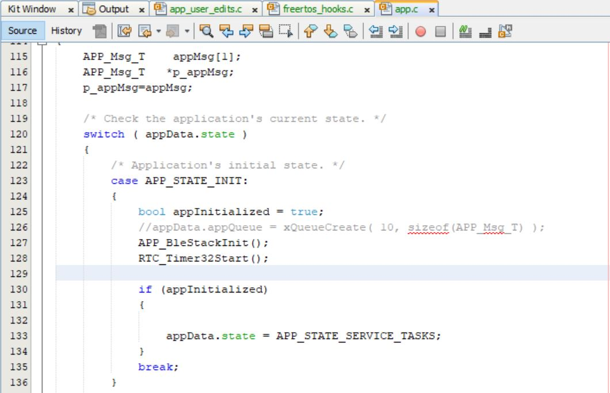


## User Application Development

### Initialize Advertisement,Custom Service and EIC in APP_Tasks function in file app.c

Add the code for enable advertisement,customer service intilization and button external interrupt callback functions in the APP_STATE_INIT.


Add the code for enable advertisement,customer service intilization and button external interrupt callback functions in the APP_STATE_INIT.


```
        /* Application's initial state. */
        case APP_STATE_INIT:
        {
            bool appInitialized = true;
            //appData.appQueue = xQueueCreate( 10, sizeof(APP_Msg_T) );
            APP_BleStackInit();
            RTC_Timer32Start();
            BLE_GAP_SetAdvEnable(0x01, 0); //Enable BLE Advertisement
            BLE_BUTTON_LED_Add();
            APP_Button_Init();
            SYS_CONSOLE_PRINT("[BLE] Device Initialized. Ready for connection. \r\n");
```
### Handle the button and RGB LED events in APP_Tasks function in file app.c

Add the RGB and button handlers to the function APP_Tasks() in app.c file.

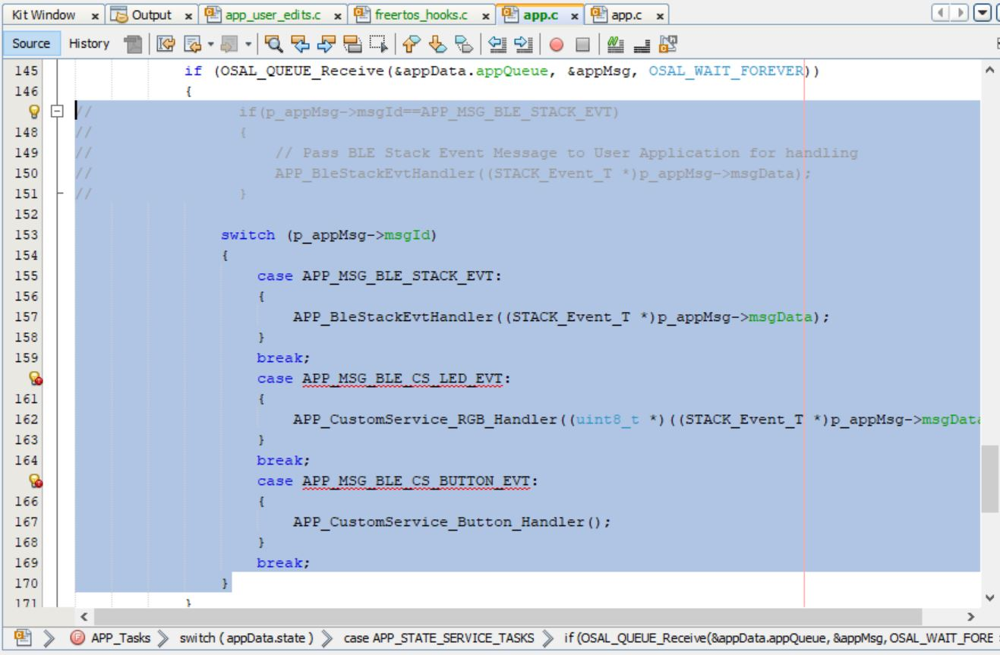

```
        case APP_STATE_SERVICE_TASKS:
        {
            if (OSAL_QUEUE_Receive(&appData.appQueue, &appMsg, OSAL_WAIT_FOREVER))
            {
//                if(p_appMsg->msgId==APP_MSG_BLE_STACK_EVT)
//                {
//                    // Pass BLE Stack Event Message to User Application for handling
//                    APP_BleStackEvtHandler((STACK_Event_T *)p_appMsg->msgData);
//                }

                switch (p_appMsg->msgId)
                {
                    case APP_MSG_BLE_STACK_EVT:
                    {
                        APP_BleStackEvtHandler((STACK_Event_T *)p_appMsg->msgData);
                    }
                    break;
                    case APP_MSG_BLE_CS_LED_EVT:
                    {
                        APP_CustomService_RGB_Handler((uint8_t *)((STACK_Event_T *)p_appMsg->msgData));
                    }
                    break;
                    case APP_MSG_BLE_CS_BUTTON_EVT:
                    {
                        APP_CustomService_Button_Handler();
                    }
                    break;
                }
            }
            break;
        }	   
```		
### Add the msg ids for the button and RGB LED events in file app.h

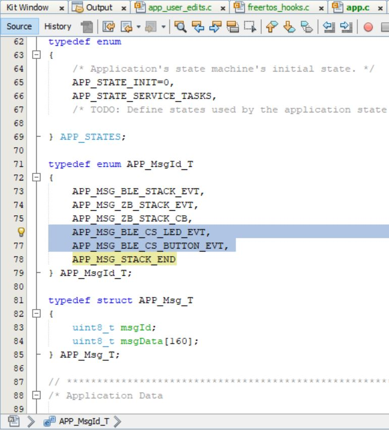

```
	typedef enum APP_MsgId_T
	{
		APP_MSG_BLE_STACK_EVT,
		APP_MSG_ZB_STACK_EVT,
		APP_MSG_ZB_STACK_CB,
		APP_MSG_BLE_CS_LED_EVT,
		APP_MSG_BLE_CS_BUTTON_EVT,        
		APP_MSG_STACK_END
	} APP_MsgId_T;
```

### Add the custom service file(app_ble_custom_service.c/.h) which has the supporting functions for Button LED Custom service file.

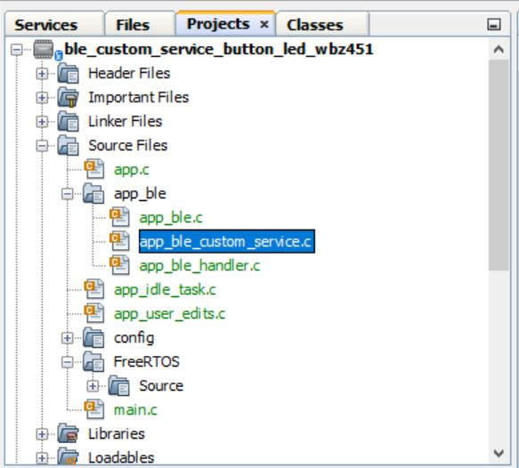

### Print the required information on the connect and discoonect events in file app_ble_hnadler.c

Add the required variables, functions and callback handlers for GATT read/write response in the file ble_handler.c along with the connect and disconnect .

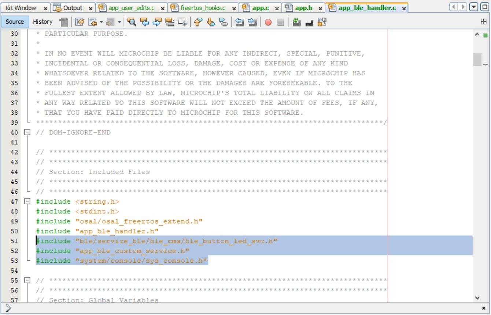
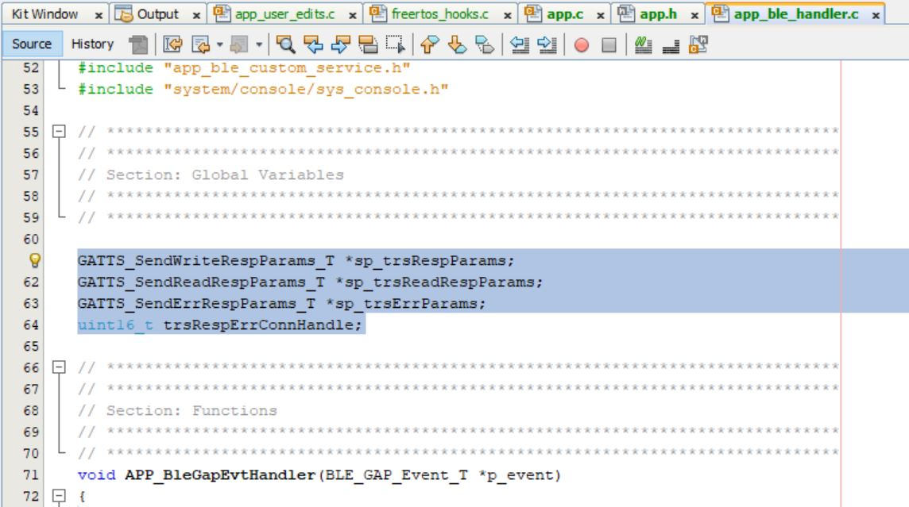
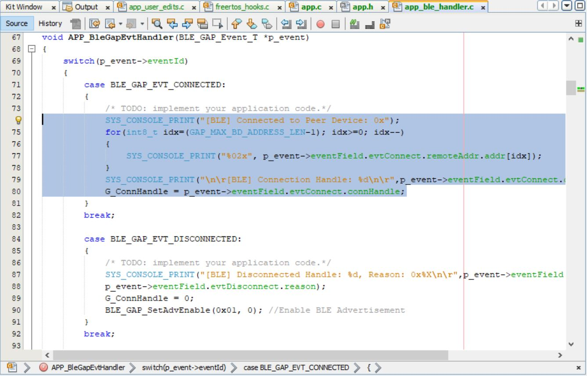
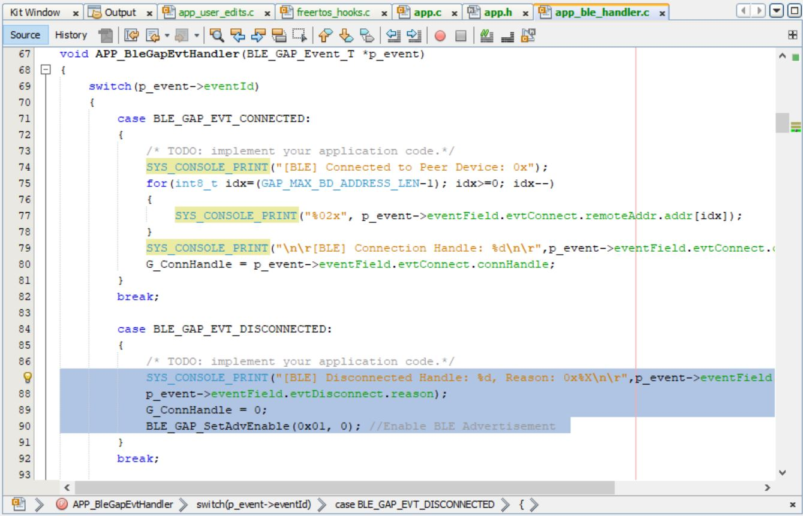

```
void APP_BleGapEvtHandler(BLE_GAP_Event_T *p_event)
{
    switch(p_event->eventId)
    {
        case BLE_GAP_EVT_CONNECTED:
        {
            /* TODO: implement your application code.*/
            SYS_CONSOLE_PRINT("[BLE] Connected to Peer Device: 0x");
            for(int8_t idx=(GAP_MAX_BD_ADDRESS_LEN-1); idx>=0; idx--)
            {
                SYS_CONSOLE_PRINT("%02x", p_event->eventField.evtConnect.remoteAddr.addr[idx]);
            }
            SYS_CONSOLE_PRINT("\n\r[BLE] Connection Handle: %d\n\r",p_event->eventField.evtConnect.connHandle);
            G_ConnHandle = p_event->eventField.evtConnect.connHandle;
        }
        break;

        case BLE_GAP_EVT_DISCONNECTED:
        {
            /* TODO: implement your application code.*/
            SYS_CONSOLE_PRINT("[BLE] Disconnected Handle: %d, Reason: 0x%X\n\r",p_event->eventField.evtDisconnect.connHandle,
            p_event->eventField.evtDisconnect.reason);
            G_ConnHandle = 0;
            BLE_GAP_SetAdvEnable(0x01, 0); //Enable BLE Advertisement             
        }
        break;
```
### Add the functions for the GATT read and write handlers which will act on the received GATT request in file app_ble_hnadler.c.
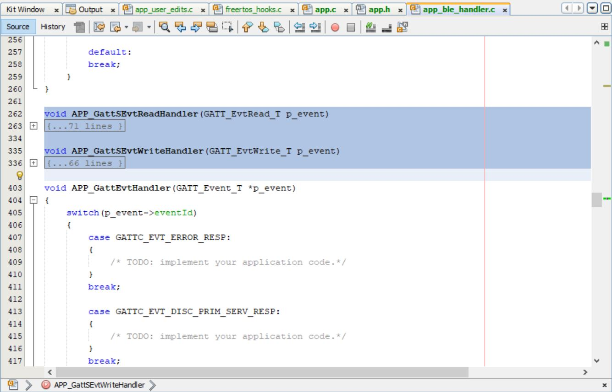
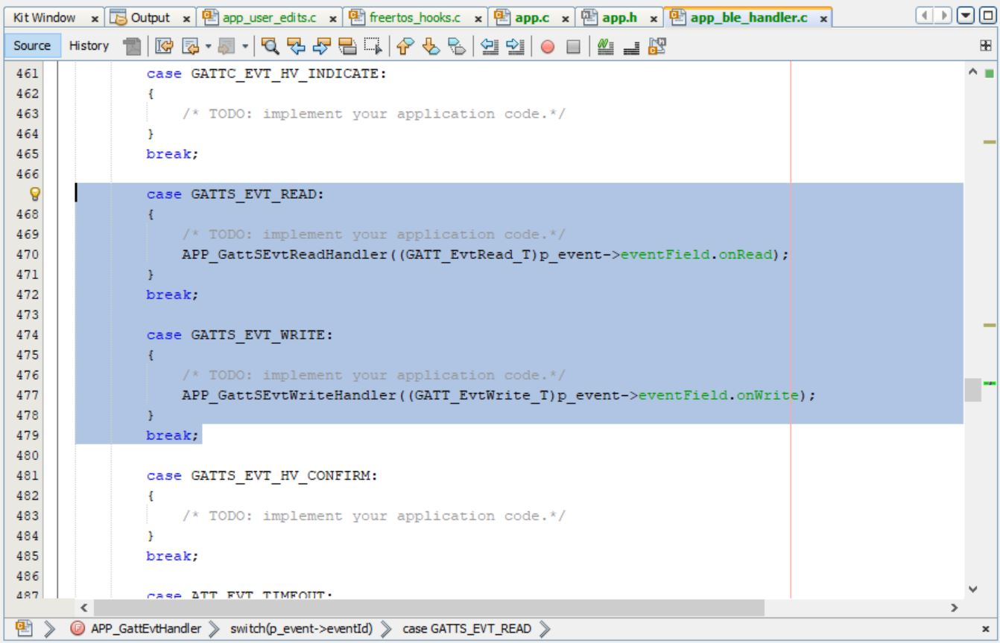
```
void APP_GattSEvtReadHandler(GATT_EvtRead_T p_event)
{

    uint8_t error = 0;
    uint16_t status;
    SYS_CONSOLE_PRINT("[BLE] GATT Read ATTR Handle 0x%X \r\n",p_event.attrHandle);

    if ((p_event.attrHandle <= BUTTON_LED_START_HDL) ||
        (p_event.attrHandle > BUTTON_LED_END_HDL))
    {
        /* Not BLE Custom Service characteristic. */
        return;
    }

        switch(p_event.attrHandle)
        {
            case BUTTON_LED_HDL_CHAR_0:                            /**< Handle of characteristic 0. */
            case BUTTON_LED_HDL_CCCD_0:                            /**< Handle of characteristic 0 CCCD . */
            case BUTTON_LED_HDL_CHAR_1:                            /**< Handle of characteristic 1. */
            case BUTTON_LED_HDL_CHARVAL_1:                         /**< Handle of characteristic 1 value. */
                error = ATT_ERRCODE_APPLICATION_ERROR;
                break;
            case BUTTON_LED_HDL_CHARVAL_0:                         /**< Handle of characteristic 0 value. */                
//                SYS_CONSOLE_PRINT(" ATTR Handle Read 0x%X \r\n",p_event.attrHandle);
                break;
        }

    if ((p_event.readType == ATT_READ_REQ)
    || (p_event.readType == ATT_READ_BLOB_REQ))
    {
        if (!error)
        {
            sp_trsReadRespParams = (GATTS_SendReadRespParams_T *)OSAL_Malloc(sizeof(GATTS_SendReadRespParams_T));
            if (sp_trsReadRespParams == NULL)
            {
                return;
            }
            trsRespErrConnHandle = p_event.connHandle;
            sp_trsReadRespParams->responseType = ATT_READ_RSP;
            sp_trsReadRespParams->attrLength = 0x01;
            sp_trsReadRespParams->attrValue[0]= bleCSdata.rgbOnOffStatus;            
//            sp_trsReadRespParams->attrLength = 0x03;
//            sp_trsReadRespParams->attrValue[0]= bleCSdata.RGB_LED.Red;
//            sp_trsReadRespParams->attrValue[1]= bleCSdata.RGB_LED.Green;
//            sp_trsReadRespParams->attrValue[2]= bleCSdata.RGB_LED.Blue;
            status = GATTS_SendReadResponse(p_event.connHandle, sp_trsReadRespParams);
            if (status == MBA_RES_SUCCESS)
            {
                OSAL_Free(sp_trsReadRespParams);
                sp_trsReadRespParams = NULL;
            }
        }
        else
        {
            sp_trsErrParams = (GATTS_SendErrRespParams_T *)OSAL_Malloc(sizeof(GATTS_SendErrRespParams_T));
            if (sp_trsErrParams == NULL)
            {
                return;
            }
            trsRespErrConnHandle = p_event.connHandle;
            sp_trsErrParams->reqOpcode = p_event.readType;
            sp_trsErrParams->attrHandle = p_event.attrHandle;
            sp_trsErrParams->errorCode = error;
            status = GATTS_SendErrorResponse(p_event.connHandle, sp_trsErrParams);
            if (status == MBA_RES_SUCCESS)
            {
                OSAL_Free(sp_trsErrParams);
                sp_trsErrParams = NULL;
            }
        }
    }   
}

void APP_GattSEvtWriteHandler(GATT_EvtWrite_T p_event)
{
    uint8_t error = 0;
    uint16_t status;
    SYS_CONSOLE_PRINT("[BLE] GATT Write ATTR Handle 0x%X \r\n",p_event.attrHandle);

    if ((p_event.attrHandle <= BUTTON_LED_START_HDL) ||
        (p_event.attrHandle > BUTTON_LED_END_HDL))
    {
        /* Not BLE Custom Service characteristic. */
        error = ATT_ERRCODE_INVALID_HANDLE;
        return;
    }

        switch(p_event.attrHandle)
        {
            case BUTTON_LED_HDL_CHAR_0:                            /**< Handle of characteristic 0. */
            case BUTTON_LED_HDL_CHARVAL_0:                         /**< Handle of characteristic 0 value. */
            case BUTTON_LED_HDL_CCCD_0:                            /**< Handle of characteristic 0 CCCD . */
            case BUTTON_LED_HDL_CHAR_1:                            /**< Handle of characteristic 1. */
                error = ATT_ERRCODE_APPLICATION_ERROR;
                break;
            case BUTTON_LED_HDL_CHARVAL_1:                         /**< Handle of characteristic 1 value. */
//                SYS_CONSOLE_PRINT(" ATTR Handle %d \r\n",p_event.attrHandle);
                APP_CustomService_RGB_Callback(p_event.writeValue);
                break;
        }

    if ((p_event.writeType == ATT_WRITE_REQ)
    || (p_event.writeType == ATT_PREPARE_WRITE_REQ))
    {
        if (!error)
        {
            sp_trsRespParams = (GATTS_SendWriteRespParams_T *)OSAL_Malloc(sizeof(GATTS_SendWriteRespParams_T));
            if (sp_trsRespParams == NULL)
            {
                return;
            }
            trsRespErrConnHandle = p_event.connHandle;
            sp_trsRespParams->responseType = ATT_WRITE_RSP;
            status = GATTS_SendWriteResponse(p_event.connHandle, sp_trsRespParams);
            if (status == MBA_RES_SUCCESS)
            {
                OSAL_Free(sp_trsRespParams);
                sp_trsRespParams = NULL;
            }
        }
        else
        {
            sp_trsErrParams = (GATTS_SendErrRespParams_T *)OSAL_Malloc(sizeof(GATTS_SendErrRespParams_T));
            if (sp_trsErrParams == NULL)
            {
                return;
            }
            trsRespErrConnHandle = p_event.connHandle;
            sp_trsErrParams->reqOpcode = p_event.writeType;
            sp_trsErrParams->attrHandle = p_event.attrHandle;
            sp_trsErrParams->errorCode = error;
            status = GATTS_SendErrorResponse(p_event.connHandle, sp_trsErrParams);
            if (status == MBA_RES_SUCCESS)
            {
                OSAL_Free(sp_trsErrParams);
                sp_trsErrParams = NULL;
            }
        }
    }
}
```

**Tip:** Manual read and write response,permissions and other standard events like GAP and GATT can be executed in the app_ble_handler.

Users can exercise various other BLE functionalities by
using [BLE Stack API](../../../docs/api/driver/ble/docs/html/modules.html)

## Where to go from here

-   [BLE Profiles and Services](../readme.md)
